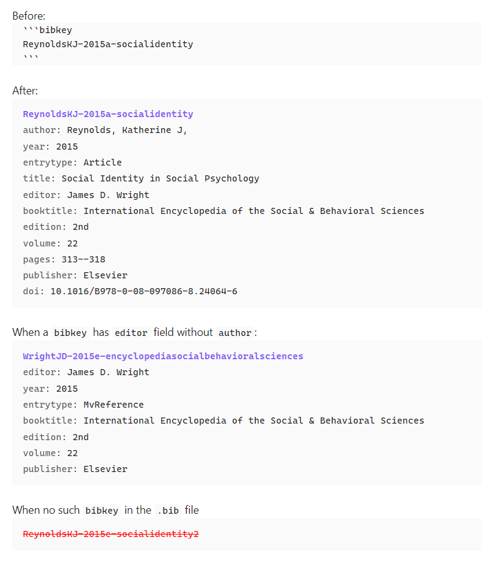

# Obsidian.md plugin bibtex entry view

## what is it



- If the plugin find the `bibtexkey` in the `.bib` file, the codeblock (first codeblock above) is replaced with the entry view of the `bibtexkey` (second codeblock).
- If the plugin cannot find the `bibtexkey` in the `.bib` file, the codeblock remains same with red colored text and canceled line (third codeblock).

## how to use it

### in the note

- Write a codeblock in the following format
````
```bibtexkey
{bibtexkey}
```
````

### in the settings 

- Put the `.bib` file in the root of the vault. And, in the settings of the plugin, you can choose the `.bib` file.
- Or, make a symbolic link to the `.bib` file in the root of the vault. And, you can choose it in the settings of the plugin.

## what to do next

- Adding the option for Sorting the fields in the order of what a user chooses in the plugin settings.
- Adding the option for hiding the field that a user chooses in the plugin settings.

## license

MIT

