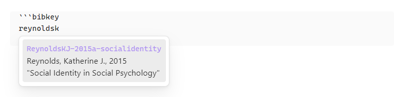
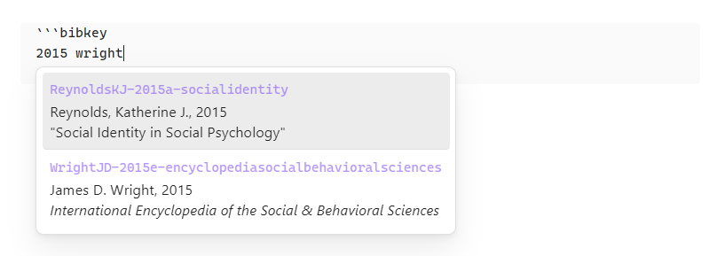
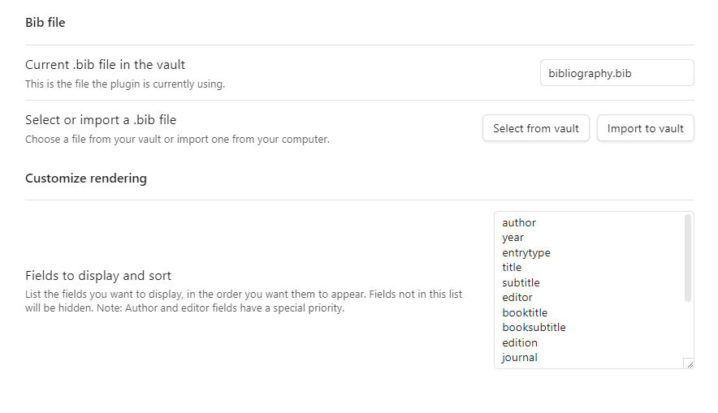

# bibtex entry view, a plugin for obsidian

## what it carries out

### renders `bibkey` codeblock


- If the plugin find the `bibkey` in the `.bib` file, the codeblock (first codeblock above) is replaced with the entry view of the `bibkey` (second codeblock).
- If the plugin cannot find the `bibkey` in the `.bib` file, the codeblock is rendered in red colored text and canceled line (fourth codeblock).

### suggests the match




- Suggested list will be shown while typing `{bibkey}` as follows. (v. 0.2.0)
- each keyword should be at least two letters long.
- The keywords for suggestion should be partial value of any `fields to display and sort` in the `settings`. (v. 0.2.1)

### What's in the `.bib` file which is generated by `jabref`.
```
@InBook{ReynoldsKJ-2015a-socialidentity,
  author           = {Reynolds, Katherine J,},
  booktitle        = {International Encyclopedia of the Social & Behavioral Sciences},
  citationkey      = {ReynoldsKJ-2015a-socialidentity},
  edition          = {2nd},
  editor           = {James D. Wright},
  pages            = {313--318},
  publisher        = {Elsevier},
  title            = {Social Identity in Social Psychology},
  year             = {2015},
  abstract         = { ... },
  creationdate     = {2024-07-22T13:12:48},
  doi              = {10.1016/B978-0-08-097086-8.24064-6},
  modificationdate = {2025-06-23T21:48:18},
}

@Book{WrightJD-2015e-encyclopediasocialbehavioralsciences,
  citationkey      = {WrightJD-2015e-encyclopediasocialbehavioralsciences},
  edition          = {2nd},
  editor           = {James D. Wright},
  publisher        = {Elsevier},
  title            = {International Encyclopedia of the Social & Behavioral Sciences},
  year             = {2015},
  creationdate     = {2025-06-23T18:01:38},
  modificationdate = {2025-06-23T21:48:59},
}
```

## what the plugin renders in the codeblock

- In the first line,
  - it shows the `bibkey` in the accent color of obsidian.
- In the second line,
  - If the bibtexentry has `author` field, it shows the author field name and its value right after the `bibkey`.
  - If the bibtexentry does not have `author` field but an `editor` field, it shows the editor field name and its value right after the `bibkey`.
  - All kinds of name are in "last, first ..." format. (v. 0.2.2)
- In the third line and so on,
  - it sorts all the other field names and their values by the order of `fields to display and sort` in the `settings` and shows them.

## so, how a user can use it

### before use it

- Put the `.bib` file in the root of the vault. 
- Or, import one in the settings.
- Or, make a symbolic link to user's own `.bib` file in the root of the vault.

### `settings` tab example



### choose a `.bib` file

- Initially, the current `.bib` file is empty.
- A user needs to choose the `.bib` file or the symbolic link in the vault.
- Or, a user can import a `.bib` file from outside the vault into the vault. 
  - Beware: This will overwrite any file that has the same name in the vault.

### customize rendering

- A user can choose fields and their order to render.

### in a note

- Write a codeblock in the following format

````
```bibkey
{bibkey}
```
````

## known bug or malfunctioning

- It seems that the plugin does not show suggestions irregularly when using a plugin `Various Complements`. Looking into this problem. (@ v. 0.2.0)

## what is planned to add next

- adding a command to manually update the entry indicies when updating the target `.bib` file of the symbolic link.
- fuzzy search for autocompletion suggestion

## support

- If you like this project, please support. 

[](https://ko-fi.com/O5O41HNOCV)

[](https://www.buymeacoffee.com/kydem)

## license

MIT

