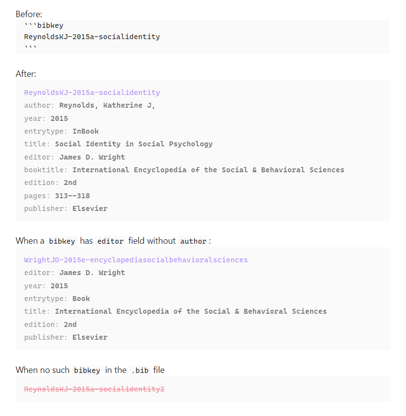

# Obsidian plugin bibtex entry view



- If the plugin find the bibtexkey in the .bib file, the codeblock (first one) is replaced with the entry view of the bibtexkey (secondcode block).
- If the plugin cannot find the bibtexkey in the .bib file, the codeblock remains same with red colored text and canceled line (third codeblock).

## how to use

### if you already have your own .bib file, 
#### in the note
- Use codeblock format as following.
````
```bibtexkey
{bibtexkey}
```
````

#### in the settings 
- put it in the root of the vault. And, in the settings of the plugin, you can choose the .bib file.
- Or, make a symbolic link to the .bib file in the root of the vault, then you can choose it in the settings of the plugin.

## license

MIT

